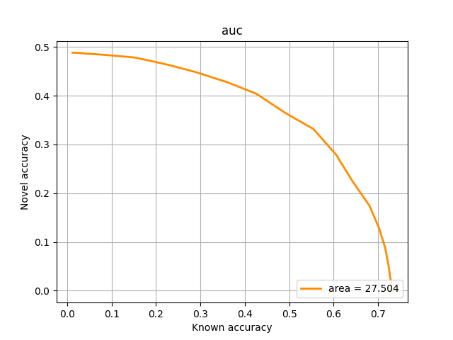
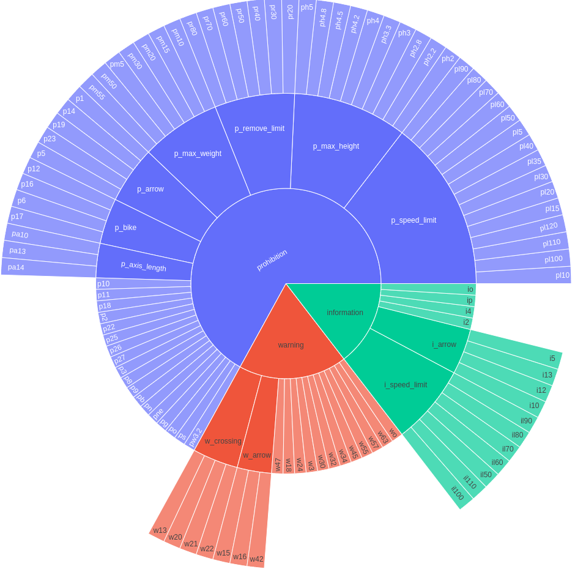

# Hierarchical Cosine Loss
Implementation of "[Hierarchical Novelty Detection for Traffic Sign Recognition](https://doi.org/10.3390/s22124389)".

If you find our work useful in your research, please cite:
```
@article{ruiz2022hierarchical,
  title={Hierarchical Novelty Detection for Traffic Sign Recognition},
  author={Ruiz, Idoia and Serrat, Joan},
  journal={Sensors},
  volume={22},
  number={12},
  article-number={4389},
  year={2022},
  url = {https://www.mdpi.com/1424-8220/22/12/4389},
  issn = {1424-8220},
  doi = {10.3390/s22124389}
}

```

## Dependencies

```h5py==2.10.0
matplotlib==3.3.2
numpy==1.19.1
Pillow==9.2.0
scikit_learn==1.1.1
torch==1.6.0+cu101
torchvision==0.7.0+cu101
```

To install these dependencies using pip:

``` pip install -r requirements.txt```

## Setup

#### Features 

When training HCL from pre-computed features, features are expected to be found under the path:

`features/{dataset}/resnet101_{split}.h5`

Download precomputed features:
 
* TT100K: [finetuned features](https://cvcuab-my.sharepoint.com/:u:/g/personal/iruiz_cvc_uab_cat/ER1EjJ14ktVKjjfTG7SXb5YB-LJJDfY4Uqlix5k47Gd9Eg?e=BaG699) <!--[mirror](https://drive.google.com/file/d/1pAEmBY4VYErjbbFxSMRKeMKdmKP4I_B2/view?usp=sharing) -->
* MTSD: [finetuned features](https://cvcuab-my.sharepoint.com/:u:/g/personal/iruiz_cvc_uab_cat/EYCuFjnnJiZApS3zYmmIS30BIRKhluzFjto-BIwXnlnZiw?e=ktMExZ) <!--[mirror](https://drive.google.com/file/d/1iu21pKba4nLouZUtRYN3jT6F9xuYN1yx/view?usp=sharing) -->
* AWA2: [ImageNet pre-trained features](https://cvcuab-my.sharepoint.com/:u:/g/personal/iruiz_cvc_uab_cat/EcOswLuC1URCjplb_exrSc4B8XT6etlOILDn6St39MdpYw?e=MYZl78) <!--[mirror](https://drive.google.com/file/d/1I2aGRmiWDfQj2xTYi5jhTOI2lt0TtQrB/view?usp=sharing) -->
* CUB: [ImageNet pre-trained features](https://cvcuab-my.sharepoint.com/:u:/g/personal/iruiz_cvc_uab_cat/EVtzA1XUzT5Fjpd5Ye0RW3IBDx3e-1p70rpV7MgHK_WZ7g?e=cRtr7g) <!--[mirror](https://drive.google.com/file/d/1OSbP33voKxwVF_cChXHksCLEpnjLb_HF/view?usp=sharing) -->

#### Splits

The splits information is expected to be under `taxonomy/{dataset}` in the following files:

* `taxonomy.txt` Taxonomy information. Parent-children relationships are indicated by indentation.
* `novel.txt` List of novel leaf classes
* `known.txt` List of known leaf classes
* `splits_data/filenames_{split}.npy.` NumPy file that contains the dict of paths to samples for the split. 

Download splits files for [TT100K](https://cvcuab-my.sharepoint.com/:u:/g/personal/iruiz_cvc_uab_cat/EeD3tQfv6s5Oq6cVNNZW74cBZGVzTuwx6TrM5DZUpTSFcw?e=uOJEoT),
[MTSD](https://cvcuab-my.sharepoint.com/:u:/g/personal/iruiz_cvc_uab_cat/EQ6tYFK_zutMu9MKUwg134kBJHVDadsS0riC-bXcJVTJ7A?e=8nyocA),
[AWA2](https://cvcuab-my.sharepoint.com/:u:/g/personal/iruiz_cvc_uab_cat/EboFq0K0ccVIrvvnpDDQF2wBnMLAOoW5RcKsOfrOZsrd0g?e=brUAyW) 
or [CUB](https://cvcuab-my.sharepoint.com/:u:/g/personal/iruiz_cvc_uab_cat/ERpYhRkq1LBLvypL0X6JSzgBYadGWOqShaPjNLb5RueogA?e=eZGYh7).
<!--mirrors [TT100K](https://drive.google.com/file/d/1leVf2Pmh079kZ5UMsNmB5guz7IfcQUgh/view?usp=sharing), [MTSD](https://drive.google.com/file/d/1iYm-3rza0BYA-5BywiNdbVWte7dpgZMY/view?usp=sharing), [AWA2](https://drive.google.com/file/d/15wS42NYgaGFlzwucsdnJXjkIRxwYO8fR/view?usp=sharing) or [CUB](https://drive.google.com/file/d/17H7LDAL37r3AXnO8Qj3dh85w7N1lWuNY/view?usp=sharing)-->

#### Hyperparameters

Hyperparameters are included in a configuration file with format [config_example.ini](config_example.ini).
Configuration files to reproduce the results reported in the paper are provided below.

#### Download model weights

Below you can find the links for the model weights and configuration files that reproduce the following results:

| Dataset  | AUC | Novel acc @50% | @70% | @80% |  Novel d_h @50% | @70% | @80% | 
|------- |----- |----------- |---- |---- |----------- |---- |---- |
| TT100K  | 84.4| 87.6 | 84.4| 81.4 | 0.14| 0.18| 0.21 |
| MTSD  | 45.7 | 50.0 | 43.2| 37.8| 0.74| 0.85| 0.96 |
| AWA2  | 33.6 | 37.5 | 33.5 | 29.4 | 1.83| 1.99| 2.14 |
| CUB  | 27.5 | 36.0 | 13.3| - | 1.35 | 1.89 | - |


For **TT100K**:


[Download](https://cvcuab-my.sharepoint.com/:u:/g/personal/iruiz_cvc_uab_cat/Efqb_eL-yCVGsWAAP-FI6f8BPzZpgkiaVpVGB2CjrmSoGw?e=EjKFVz) HCL weights and configuration files

For **MTSD**:


[Download](https://cvcuab-my.sharepoint.com/:u:/g/personal/iruiz_cvc_uab_cat/EQdVKtdpWm9OksI3F-HVL-IBWsbjV8wnNHwrMltHdxip2g?e=gRVRh9) HCL weights and configuration files

For **AWA2**:


[Download](https://cvcuab-my.sharepoint.com/:u:/g/personal/iruiz_cvc_uab_cat/EWu1c19_zqJKuvitUUwHsooBV9Yi7vC3vay3-KKpN20TLw?e=biwVhG) HCL weights and configuration files

For **CUB**:



[Download](https://cvcuab-my.sharepoint.com/:u:/g/personal/iruiz_cvc_uab_cat/EUngrvPTPjBLrjB1bq558okBRE3Sa3gm74yAHKodpOvnvA?e=A7g80j) HCL weights and configuration files


## Training

#### Training HCL from pre-computed features
To run the training script:

`python -m torch.distributed.launch --nproc_per_node=<num of GPUs>  launch_train_from_precomputed_feat.py --exp_dir <path/to/exp/dir/> --config <path/to/config_file.ini>`

Example:

`CUDA_VISIBLE_DEVICES=0 python -m torch.distributed.launch --nproc_per_node=1  launch_train_from_precomputed_feat.py --exp_dir ./output/train_experiment1/ --config ./output/train_experiment1/config.ini`

To resume training from a checkpoint:

`CUDA_VISIBLE_DEVICES=6 python -m torch.distributed.launch --nproc_per_node=1 launch_train_from_precomputed_feat.py --exp_dir ./output/train_experiment1/ --config ./output/train_experiment1/config.ini --checkpoint ./output/train_experiment1/checkpoint_loss.pth.tar`

#### Training the full model

`python -m torch.distributed.launch --nproc_per_node=<num of GPUs> launch_train_full_model.py --exp_dir <path/to/exp/dir/> --config <path/to/config_file.ini>`

Example with 4 GPUs (devices 1,2,3,4):

`CUDA_VISIBLE_DEVICES=1,2,3,4 python -m torch.distributed.launch --nproc_per_node=4 launch_train_full_model.py --exp_dir ./output/train_experiment2/ --config ./output/train_experiment2/config.ini`

To resume training from a checkpoint:

`CUDA_VISIBLE_DEVICES=1,2,3,4 python -m torch.distributed.launch --nproc_per_node=4 launch_train_full_model.py --exp_dir ./output/train_experiment2/ --config ./output/train_experiment2/config.ini --checkpoint_dir ./output/train_experiment2/` 


## Evaluation

To run only evaluation for a saved checkpoint:

#### HCL trained from pre-computed features
`CUDA_VISIBLE_DEVICES=6 python -m torch.distributed.launch --nproc_per_node=1 launch_train_from_precomputed_feat.py --exp_dir ./output/train_experiment1/ --config ./output/train_experiment1/config.ini --checkpoint ./output/train_experiment1/checkpoint_loss.pth.tar --only_eval`

#### Full model trained
`CUDA_VISIBLE_DEVICES=6 python -m torch.distributed.launch --nproc_per_node=1 launch_train_full_model.py --exp_dir ./output/train_experiment1/ --config ./output/train_experiment1/config.ini --checkpoint_dir ./output/train_experiment1 --only_eval`


## Taxonomies
### TT100K


View at full size and navigate through the hierarchy [here](https://idoiaruiz.github.io/HierarchicalCosineLoss/tsinghua.html)

### MTSD


View at full size and navigate through the hierarchy [here](https://idoiaruiz.github.io/HierarchicalCosineLoss/mtsd.html)

### AWA2


View at full size and navigate through the hierarchy [here](https://idoiaruiz.github.io/HierarchicalCosineLoss/awa2.html)

### CUB


View at full size and navigate through the hierarchy [here](https://idoiaruiz.github.io/HierarchicalCosineLoss/cub.html)
